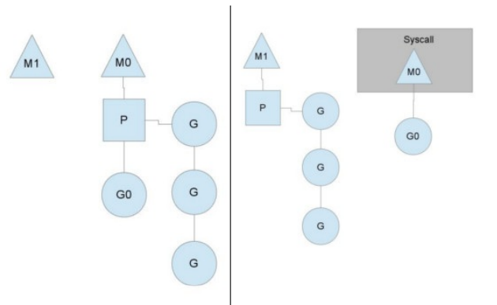
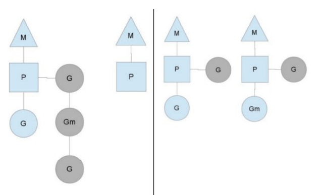

# goroutine协程

**1. 概念**  
- 进程  
    进程是应用程序的启动实例，每个进程都有独立的内存空间。
- 线程  
  CPU调度的基本单位，多个线程之间可以共享进程的资源，并通过共享内存等线程间的通信方式来通信
- 协程  
  可以理解为一种轻量级的线程。与线程相比，协程不受操作系统调度，协程调度器由应用程序提供，协程调度器按照调度策略把协程调度到线程中运行。  
**2. 工作原理**  
- 工作在用户态的协程能大大减少上下文切换的开销。协程调度器把可运行的协程逐个调度到线程中执行，同时把阻塞的协程调度出线程，从而有效的避免了线程的频繁切换，达到使用少量线程实现高并发的效果。
- 多个协程分享操作系统分给线程的时间片，从而达到充分利用CPU算力的目的，协程调度器则决定了协程运行的顺序  
**3. 调度模型**
- 线程模型
  - 线程分为用户线程和内核线程
      - 用户线程: 由用户创建、同步和销毁
      - 内核线程: 有内核管理
  - N:1模型: N个用户线程运行在1个内核线程中，优点是用户线程上下文切换快，缺点是无法充分利用CPU多核的算力
  - 1:1模型: 每个用户线程对应一个内核线程，优点是充分利用CPU算力，缺点是线程上下文切换较慢
  - M:N模型: M个用户线程（协程）运行在N个线程中，优点是充分利用CPU的算力且协程上下文切换快，缺点则是该模型的调度算法较为复杂
- Go 调度器模型
  - 三个关键实体：
    - machine(M)：工作线程，由操作系统调度
    - processor(P)：处理器（Go定义的一个概念，不是指CPU），包含Go代码的必要资源，也有调度goroutine的能力。
    - goroutine(G)：即Go协程，每个go关键词都会创建一个协程
  - M必须持有P才可以执行代码，跟系统中的其他线程一样，M也会被系统调用阻塞
  - P的个数在程序启动时决定，默认情况下等同于CPU的核数，可以通过一下方法设置
    - 设置环境变量 ,例如export GOMAXPROCS = 80
    - 程序中使用 runtime.GOMAXPROCS()方法
  - M的个数通常稍大于P的个数，因为除了运行Go代码，runtime包还有其他内置任务需要处理
  - 简单的调度模型（全局runqueues,工作线程M,处理器P,正在运行的协程G,以及用于保存等待被调度的协程的局部runqueues）
    - Go1.1之前只包含局部runqueues，多个处理器P通过互斥锁来调度列表中的协程，（不好的原因），在多核环境下，多个处理器需要经常争抢锁来调度全局列表中的线程，严重影响了并发执行效率。
    - 后来引入局部runqueues,P调用自己的runqueues,不需要加锁。
    - 一般来说，处理器P中的协程G额外在创建的协程会加入本地的runqueues中，但如果本地的队列已满，或者阻塞的协程被唤醒，则协程会被放入全局的runqueues中，处理器P除了调度本地的runqueues中的协程外，还会周期性的从全局中摘取协程来调度。
**4. 调度策略**
- 队列轮转
  - P依次执行协程队列
  - 周期性查看全局队列中是否有协程G待运行并将其调度到M中执行。全局队列中的G主要来自从系统调用中恢复的G,防止全局中的G长时间不被调用而“饿死”
- 系统调用
  - 一般情况下，M的个数会略大于P的个数，多出来的M将会在G产生系统调用时发挥作用。
  - 例子 P91 ：
    - G0进入系统调用：
      - M0 释放P,冗余M1获取P,继续执行P队列中剩余的G 
    - G0介绍系统调用：
      - 如果有空闲P，获取一个P，继续执行G0 
      - 如果没有空闲P，G0放入全局队列，等待被其他的P调度，然后M0进入缓存池睡眠
- 工作量窃取
  - 现象：
  - 原理：
    - 窃取前，P在没有协程需要调度的情况下会先查询全局队列，如果全局队列也没有需要调度的协程
    - 从另一个P中偷取协程，每次偷一半
- 抢占式调度
  - 调度器会监控每个协程的执行时间，一旦执行时间过长，且有其他协程在等待时，会把协程暂停，转而调度等待的协程，已达到类似于时间片轮转的效果 
- GOMAXPROCS对性能的影响

