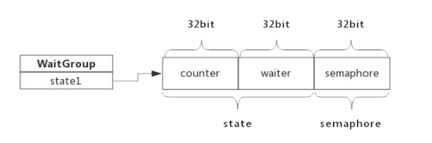
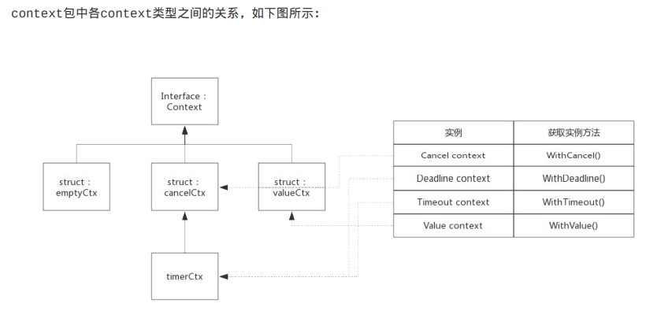
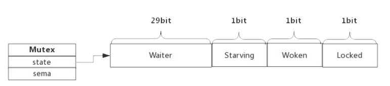

# 并发控制
1. 控制子协程
- channel
  - 优点：实现简单
  - 缺点：channel需要和协程同样数量，而且对于子协程派生出来的协程不方便控制
- waitGroup
  - 前提学习：信号量
    - UNIX系统提供的一种保护共享资源的机制，用于防止多个线程同时访问某个资源
    - 可以简单理解为数值
      - 当信号量>0时，表示资源可用
      - 当信号量=0时，表示资源暂不可用
  - 数据结构
  ```
  type waitGroup struct{
        state1 [3]uint32
        // state1包含state和一个信号量，而state实际上是两个计数器
        // 1. counter: 当前还为执行结束的goroutine
        // 2. waiter count：等待goroutine-group结束的goroutine数量，即有多少个等候着
        // 3. semaphore 信号量
  }
  ```
  
    - 三个函数
      - Add()
        - delta值累加到counter中
        - 当counter变成0时，根据waiter数量释放等量的信号量，把等待的goroutine全部唤醒，如果counter变为负值，触发panic
      - Wait()
        - 累加waiter
        - 阻塞等待信号量
      - Done()
        - counter-1
- context
  - 优点： 可以控制多层的goroutine
  - 接口的4个方法
    - Deadline():返回deadline和是否设置deadline的bool值
    - Done():返回一个channel，需要在select-case中使用。
    - Err():描述context关闭的原因。
      - 因deadline关闭 context deadline exceeded
      - 主动关闭 context cancel
    - Value(): 
  - 实现Context的结构体
  
    - 空context(emptyCtx),作context的根节点
      - 包中定义:可使用context.Background()得到
      - 使用地方，创建不同类型context时，如果没有父context,都需要传background作为其父节点
        - WithCancel()
        - WithDeadline()
        - WithTimeout()
        - WithValue()
    - cancelCtx
      - 注意 <- ctx.Done(),当管道关闭时，缓冲区无数据时，读取返回零值 
    - timerCtx
    - valueCtx
      - key-value对，可以在各级协程间传递数据
2. Mutex
- 数据结构
  - ```
    type Mutex struct{
      state int32     // 互斥锁状态
      sema  uint32    // 信号量
    }
    ```
  - 详细
    
    - Locked: 表示Mutex是否被锁定，0未锁定 1 锁定
    - Woken:  是否有协程已被唤醒。0 没有 1 有，正在加锁过程中
    - Starving: Mutex是否处于饥饿状态，0 不是 ,1 是,有协程阻塞了超过1ms
    - Waiter: 表示阻塞等待锁的协程个数，协程解锁时根据此值判断是否需要释放信号量
- 方法
  - Lock()
  - UnLock()
- 模式
  - Normal(默认):
    - 协程加锁不成功，会先判断是否满足自旋条件，如果满足则自旋，不满足则阻塞 
  - Starving
    - 释放锁时，释放信号量唤醒等待协程，如果被唤醒协程发现锁已被占用，只好再次阻塞。阻塞前会先判断上次阻塞到本次阻塞的时间是否超过1ms，如超过，Mutex标记为饥饿模式，然后阻塞。
    - 饥饿模式下，不会启动自旋，一旦有协程释放锁，一定会唤醒等待协程，被唤醒的协程成功获取锁，等待计数-1
- 自旋
  - 条件（不忙的时候才会开启）
    - 自旋次数要足够少，通常为4次
    - CPU核数要大于1
    - 协程调度机制中的Process的数量要大于1
    - 协程调度机制中的可运行队列必须为空
  - 优势
    - 充分利用CPU，尽量避免协程切换
  - 劣势
    - 如果自旋获得锁，等待协程容易进入饥饿状态
    - 解决方法：参考Starving模式
- RWMutex
  - 方法
    - RLock(): 读锁定
    - RUnLock()
    - Lock()
    - UnLock()
  - 场景分析
    - 写操作阻止写操作
      - 读写锁包含一个互斥锁，写锁定必须先获取该锁
    - 写操作阻止读操作
      - 写锁定时，readerCount - 2^30,读操作检测到是负数，便知道有写操作，会阻塞
      - 写释放时，readerCount + 2^30
    - 读操作阻止写操作
      - 读锁定会将RWMutex.readerCount 的值加1，写操作发现读数量不为0，会阻塞等待读操作执行结束 
    - 写操作防止饿死
      - 写操作到来前，复制readerCount到readerWait中