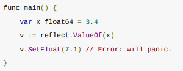
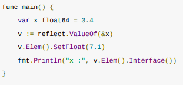

# 反射
1. 反射
- 是什么？运行时检查自身结构的机制
- reflect.DeepEqual类型用于比较任意两个结构体
- 原理：
  - 为什么interface变量可以存储任意实现了该接口类型的变量？
  - interface{}数据结构
  ```
  type iface struct{
    tab   *itab           // 储存变量类型
    data  unsafe.Pointer  // 变量值位于堆栈的指针
  }
  ```
2.reflect包
  - reflect.Type:实际类型
  - reflect.Value:值
  - reflect.Kind:特殊类型（如int、string、struct...）

3. NumField()和Field()
  - NumField():只有在结构体中使用，返回结构体中字段的数量
  - Field(i int):返回字段i对应的reflect.Value
4. 反射三大定律
- 反射可以将interface类型变量转换成反射对象
  - 不是接口的变量先被转换成空接口传入
- 反射对象转换为interface
  - interface()
- 反射对象值可修改
  - 错误  
    
  - 正确  
    